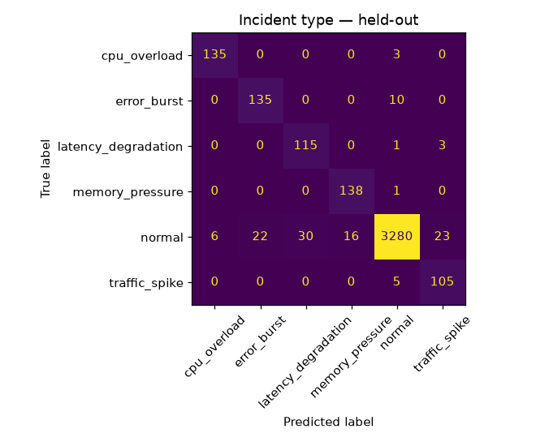
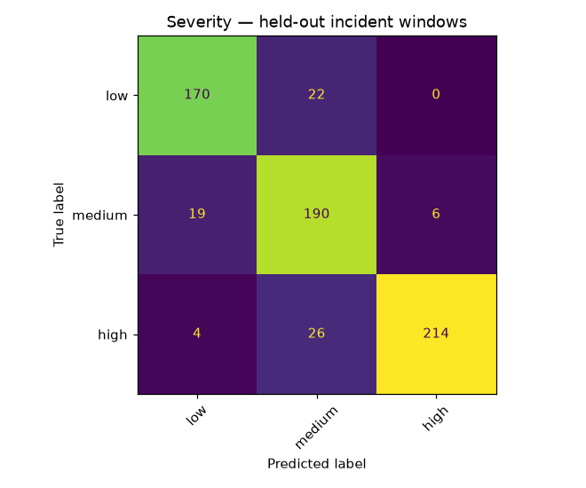

# AEGIS-AI — Evaluation Report

Held-out test servers: `['srv-14', 'srv-15', 'srv-16', 'srv-17']` (4028 windows, none seen in training).

### Incident-type classifier

| class | precision | recall | f1 | support |
|---|---|---|---|---|
| cpu_overload | 0.957 | 0.978 | 0.968 | 138 |
| error_burst | 0.860 | 0.931 | 0.894 | 145 |
| latency_degradation | 0.793 | 0.966 | 0.871 | 119 |
| memory_pressure | 0.896 | 0.993 | 0.942 | 139 |
| normal | 0.994 | 0.971 | 0.982 | 3377 |
| traffic_spike | 0.802 | 0.955 | 0.871 | 110 |
| **accuracy** | | | 0.970 | |
| macro avg | 0.884 | 0.966 | 0.921 | 4028 |
| weighted avg | 0.973 | 0.970 | 0.971 | 4028 |

### Severity classifier (true-incident windows only)

| class | precision | recall | f1 | support |
|---|---|---|---|---|
| low | 0.881 | 0.885 | 0.883 | 192 |
| medium | 0.798 | 0.884 | 0.839 | 215 |
| high | 0.973 | 0.877 | 0.922 | 244 |
| **accuracy** | | | 0.882 | |
| macro avg | 0.884 | 0.882 | 0.881 | 651 |
| weighted avg | 0.888 | 0.882 | 0.883 | 651 |

### Anomaly detector (IsolationForest)

Positive class = window overlaps a true incident. The detector is trained on normal windows only, so this measures how well 'unlike normal' lines up with 'is an incident'.

| metric | value |
|---|---|
| precision | 0.705 |
| recall | 0.911 |
| f1 | 0.795 |
| true pos / false pos | 593 / 248 |
| false neg / true neg | 58 / 3129 |
